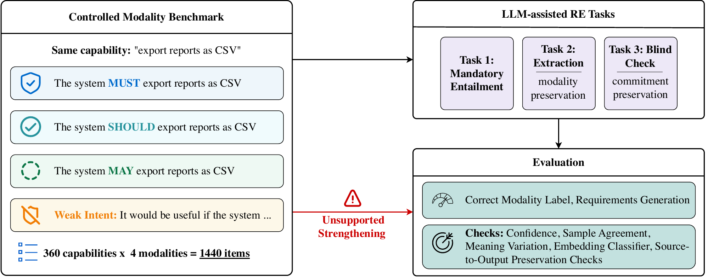

# When Weak Intent Becomes a Requirement

This repository is the evaluation artifact for the IST short communication
**"When Weak Intent Becomes a Requirement: Limits of Uncertainty Signals for
Modal-Force Strengthening in LLM-Assisted Requirements Engineering."**

> **Read the setup first.** The complete experimental setup — benchmark
> construction, prompts as actually sent, batching policy and its confound,
> model cohort, request parameters, and limitations — is in
> [`docs/experimental_setup.md`](docs/experimental_setup.md). Aggregation scope
> for every headline number is in [`docs/aggregation.md`](docs/aggregation.md).
> Known gaps and planned work are in [`TODO.md`](TODO.md).

## Graphical Abstract

[](docs/figures/graphical_abstract.pdf)

## In One Minute

LLMs can extract the right feature from a stakeholder statement but change how
strongly the stakeholder meant it.

Example:

- Source: "It would be useful if the system could export reports."
- Risky extraction: "The system should export reports."

The feature is the same. The commitment is not. A weak wish has become a
stronger requirement.

This project tests that failure mode in LLM-assisted requirements engineering
(RE). It asks whether common uncertainty signals notice when this happens.

## Main Takeaway

Label accuracy is not enough.

In the paper, models often preserve the declared modality label, but the
generated requirement text can still strengthen the source. These strengthened
outputs are usually high-confidence and stable across repeated samples.

That means RE uncertainty checks should ask:

- Did the generated text preserve the stakeholder's commitment?
- Did the model strengthen weak or optional language?
- Would a reviewer notice the change from uncertainty signals alone?

## Study At A Glance

| Piece | What it means |
| --- | --- |
| Core construct | Requirement modal force: how strong the stakeholder commitment is. |
| Modal scale | `mandatory > recommended > optional > weak stakeholder intent` |
| Datasets | NICE/PROMISE and `limsc/mlm-tapt-requirements` |
| Benchmark size | 360 reviewed seeds x 4 source variants = 1440 items |
| Main wording | `MUST`; `SHALL` is a robustness variant |
| Main risk | High-confidence strengthening of weak intent |

The study uses controlled minimal pairs. For each reviewed capability, only the
source modal force changes:

- `MUST`: mandatory
- `SHOULD`: recommended
- `MAY`: optional
- `It would be useful if ...`: weak stakeholder intent

## Tasks

| Task | Purpose |
| --- | --- |
| Task 1: mandatory entailment | Checks whether a mandatory requirement is supported by the source. |
| Task 2: modality-preserving extraction | Main task: extracts one requirement and a modality label. |
| Task 3: blind audit | Diagnostic task: checks whether Task 2 text preserves, strengthens, or weakens the source. |

Task 3 is not a final verifier. It is a stress test for whether an audit prompt
can catch text-level modal-force changes.

## Prompts Per Task

The findings here are not the product of one carefully tuned prompt. Every prompt
is frozen as a plain text file, content-addressed by SHA-256 in
[`outputs/benchmark_manifest*.json`](outputs/), and verified by the analysis gate.
Each task also ships **sensitivity/ablation variants** that exist specifically to
show the effect is not an artifact of a single phrasing (see
[`prompts/README.md`](prompts/README.md) for the full index). The frozen
single-item prompts are reproduced below. The `{{...}}` braces are literal in the
frozen file; `{source_statement}` and similar are the only substituted fields.

**These files define the task contract, but they are not the literal request
body of the production runs.** Every real run in this repository sent a
*batched* prompt: 16 benchmark items per request, built by
`batch_prompt_for_completion_jobs` in `scripts/eval_utils.py`, asking for an
array of results keyed by `request_index`. The batched wrapper restates the same
task, the same label set, and the same `0.0-1.0` confidence contract; it differs
in surface form. The batched prompt bodies are reproduced verbatim, and the
batching confound is analysed, in
[`docs/experimental_setup.md`](docs/experimental_setup.md).

### Task 1 — Mandatory Entailment (control)

Does the source statement entail the candidate *mandatory* requirement?
Source: [`prompts/mandatory_entailment.txt`](prompts/mandatory_entailment.txt).

```text
You are reviewing software requirements.

Source statement:
"{source_statement}"

Candidate requirement:
"{candidate_requirement}"

Question:
Is the candidate a faithful mandatory requirement entailed by the source?

Return JSON only:
{{
  "decision": "yes" | "no",
  "confidence": 0.0-1.0,
  "brief_reason": "<max 12 words>"
}}

Use confidence as a decimal probability for confidence in the selected decision.
Do not return percentages such as 95 or strings such as "95%".
```

Robustness variant: [`prompts/mandatory_entailment_strict.txt`](prompts/mandatory_entailment_strict.txt)
(stricter wording, run on the pilot subset).

### Task 2 — Modality-Preserving Extraction (main task)

Extract one requirement and label its modality, preserving the source modal force.
Source: [`prompts/modality_extraction.txt`](prompts/modality_extraction.txt).

```text
Extract exactly one requirement from the source statement.
Preserve the modality of the source.

Source:
"{source_statement}"

Return JSON only:
{{
  "requirement": "...",
  "modality": "mandatory" | "recommended" | "optional" | "nice_to_have",
  "confidence": 0.0-1.0
}}

Use confidence as a decimal probability for confidence in the selected modality.
Do not return percentages such as 95 or strings such as "95%".
```

Robustness variant: [`prompts/modality_extraction_labels_only.txt`](prompts/modality_extraction_labels_only.txt)
(states the allowed labels without mapping rules or examples).

### Task 3 — Blind Text Audit (diagnostic)

Given the source and the Task 2 output, judge whether the requirement preserves,
strengthens, weakens, or changes the content — **without** seeing the declared
Task 2 modality. Source: [`prompts/modality_verification.txt`](prompts/modality_verification.txt).

```text
You are auditing whether an extracted software requirement preserves the source statement.

Source statement:
"{source_statement}"

Extracted requirement:
"{extracted_requirement}"

Question:
Compared with the source statement, does the extracted requirement preserve, strengthen, weaken, or change the functional content?

Use these labels:
- preserves: same functional content and same modality strength
- strengthens: same functional content but stronger modality or stakeholder commitment
- weakens: same functional content but weaker modality or stakeholder commitment
- content_changed: functional content was added, removed, or changed

Return JSON only:
{{
  "relation": "preserves" | "strengthens" | "weakens" | "content_changed",
  "confidence": 0.0-1.0,
  "evidence_phrase": "<exact phrase from the source that supports the relation>",
  "brief_reason": "<max 16 words>"
}}

Use confidence as a decimal probability for confidence in the selected relation.
Do not return percentages such as 95 or strings such as "95%".
```

Ablation variant: [`prompts/modality_verification_declared.txt`](prompts/modality_verification_declared.txt)
(reveals the declared Task 2 modality to measure anchoring).

The allowed labels and the `0.0-1.0` confidence contract are not free text: they
are enforced as Pydantic models in
[`scripts/structured_outputs.py`](scripts/structured_outputs.py) and covered by
[`tests/test_structured_outputs.py`](tests/test_structured_outputs.py).

## Model Cohort

The official cohort is six models over two endpoints:

| Model | Endpoint |
| --- | --- |
| `glm-4.5-air`, `glm-4.7`, `glm-5`, `glm-5-turbo`, `glm-5.1` | z.ai |
| `kit.gemma4-31b-it` | KIT institutional endpoint (`kit_toolbox` profile) |

Five of the six are from one model family. `azure.*` rows in local registries
are private-endpoint diagnostics and are excluded from every paper-facing
aggregate. Full request parameters are in
[`docs/experimental_setup.md`](docs/experimental_setup.md).

## Reported Paper Findings

Each headline is stated with its aggregation scope over the four
dataset x variant cells (mlm_tapt/nice x must/shall). All of them were measured
under 16-item grouped batching, described below:

- Declared modality labels were preserved.
- Generated text still strengthened source modal force in 8.6% of cases under
  strict evidence (pooled over all 4 cells, n=16,448; macro-of-cells is also
  8.6%). Under broad evidence it was 13.8% (pooled, the conservative headline
  convention; the unweighted macro-of-cells is 13.9%).
- For weak stakeholder-intent sources, strict strengthening reached 29.8% in
  the mlm_tapt/MUST cell at confidence >= 0.90 — 304 of the 1,020 weak-intent
  rows whose generated text had a readable modality, or 28.1% of all 1,080 weak
  rows in the cell (cross-cell range 27.4-31.7%).
- Strengthened outputs were usually high-confidence: 98.4% as an unweighted
  macro over cells (per-cell n 296-436) at confidence >= 0.90.
- Strengthened outputs showed 100.0% repeated-sample agreement, i.e. 5
  stochastic samples at temperature 0.7 agreed on modality under saturated
  label accuracy; read this as sampling stability, not robustness.
- Semantic dispersion, embedding probes, and blind audits helped only partly.

**Batching confound.** Every one of these numbers comes from batched requests
of 16 benchmark items. Batches are consecutive request indices with no
shuffling, and benchmark rows are ordered seed x variant, so each Task 2 batch
contained all four modality variants (`MUST`, `SHOULD`, `MAY`, `It would be
useful if ...`) of the same four seeds side by side. The prompt asks the model
to treat items independently, but the minimal-pair contrast was inside its
context window. Contrastive context plausibly makes modality preservation
easier, which would make the reported strengthening rates conservative — but
that direction is an assumption until the shuffled-batch and single-item
ablations are run. `batch_order: shuffled` is now a *constrained* shuffle that
never places two variants of one seed in the same batch; the earlier
implementation only permuted job order and, at batch size 16, still co-located
two variants of one seed in roughly half of the 45 Task 2 batches (22 to 24 depending on the derived RNG seed), so it would not have
removed the contrast it was meant to ablate. See
[`docs/experimental_setup.md`](docs/experimental_setup.md) and
[`TODO.md`](TODO.md) section A.

Interpret these numbers through the artifact status below. Checked metric
snapshots in this repository are diagnostic/stale unless regenerated from a
complete current run. These aggregates are re-derived from the per-cell
snapshots by
[`scripts/aggregate_paper_headline_metrics.py`](scripts/aggregate_paper_headline_metrics.py)
and by `scripts/export_paper_tables.py`; the pooling rules are specified in
[`docs/aggregation.md`](docs/aggregation.md). Every headline above reproduces
exactly from the raw run files (strict `1412/16448`, broad `2268/16448`). The
regenerated per-cell snapshots carry the same headline values as the shipped
ones but are no longer byte-identical to them: they add the weak-intent
strengthening columns and a `parse_failure_rate` computed from the raw Task 2
deterministic rows (see [`docs/aggregation.md`](docs/aggregation.md) §3 and §5).
Per-model strict strengthening ranges from 0.3% (`glm-4.7`) to 16.9%
(`kit.gemma4-31b-it`), with seed-clustered 95% CIs in
[`outputs/paper_per_model_headline.csv`](outputs/paper_per_model_headline.csv),
and the pooled strict CI is [8.2%, 9.0%] against [13.2%, 14.4%] broad.

## Where To Go

| You want to ... | Read |
| --- | --- |
| See the full experimental setup | [`docs/experimental_setup.md`](docs/experimental_setup.md) |
| Understand the study design | [`docs/evaluation.md`](docs/evaluation.md) |
| Know how headline numbers are aggregated | [`docs/aggregation.md`](docs/aggregation.md) |
| Reproduce the pipeline | [`docs/reproduction.md`](docs/reproduction.md) |
| Run without API credentials | [`docs/reproduction_smoke.md`](docs/reproduction_smoke.md) |
| Trace a result to inputs | [`docs/results_mapping.md`](docs/results_mapping.md) |
| Understand the code/data layout | [`docs/repository_layout.md`](docs/repository_layout.md) |
| Understand the pipeline architecture | [`docs/architecture.md`](docs/architecture.md) |
| Understand artifact policy | [`docs/repository_hygiene.md`](docs/repository_hygiene.md) |
| See common reviewer questions | [`docs/faq.md`](docs/faq.md) |
| See open gaps and planned work | [`TODO.md`](TODO.md) |

## Quick Check

Use this path if you only want to confirm that the repository is wired
correctly.

```bash
uv sync --group dev --locked
.venv/bin/python -m unittest discover -s tests -v

cp run_configs/full_matrix.example.json run_configs/current_run.json
bash scripts/reproduce.sh smoke-fake
```

The `smoke-fake` path uses local fake completions. It does not call a provider
and does not reproduce paper results.

`scripts/reproduce.sh` has built-in defaults, and **the default cell points at a
paid provider** (`RE_UQ_PROFILE=zai`, `RE_UQ_MODEL=glm-5.1`). That is harmless
for `smoke-fake`, which never opens a connection, but any other subcommand will
try to bill an account. Override the cell explicitly:

| Variable | Default | Meaning |
| --- | --- | --- |
| `RE_UQ_CONFIG` | `run_configs/current_run.json` | Run config path. |
| `RE_UQ_PROFILE` | `zai` | Provider profile id (paid endpoint). |
| `RE_UQ_MODEL` | `glm-5.1` | Model id (paid endpoint). |
| `RE_UQ_DATASET` | `mlm_tapt` | `nice` or `mlm_tapt`. |
| `RE_UQ_VARIANT` | `must` | `must` or `shall`. |
| `RE_UQ_MODE` | `full` | Run mode for the `task3` subcommand. |
| `RE_UQ_RUN_ID` | _(unset)_ | Explicit run id for `task3` / `analysis` source lookups. |

```bash
RE_UQ_PROFILE=local_llama_cpp RE_UQ_MODEL=qwen/qwen3.5-9b \
  bash scripts/reproduce.sh smoke
```

`scripts/reproduce.sh` also offers fake-completion smoke paths for the
downstream stages — `smoke-fake-task3`, `smoke-fake-analysis`, and
`smoke-fake-all` which chains all three. They need no API key and write into a
separate `data/processed/smoke/` tree (analysis under `outputs/smoke/`), so a
smoke run never touches real run artifacts. Every subcommand prints a
`resolved: ...` line naming the cell it is about to use. See
[`docs/reproduction_smoke.md`](docs/reproduction_smoke.md).

```bash
bash scripts/reproduce.sh smoke-fake-all
```

## Full Provider Run

For real results, configure a provider in `run_configs/current_run.json`, then
run Task 1+2, Task 3, and analysis in that order.

```bash
PROFILE="your_profile_id"
MODEL="your_model_id"
DATASET="mlm_tapt"      # nice | mlm_tapt
VARIANT="must"          # must | shall

.venv/bin/python scripts/run_experiment_from_config.py \
  --config run_configs/current_run.json \
  --profile "${PROFILE}" \
  --model "${MODEL}" \
  --dataset "${DATASET}" \
  --variant "${VARIANT}" \
  --task both \
  --mode full
```

Then take the completed Task 1+2 `RUN_ID` from
`data/processed/run_registry*.csv` and run blind Task 3:

```bash
SOURCE_RUN_ID="full-..."

.venv/bin/python scripts/run_task3_verification_from_config.py \
  --config run_configs/current_run.json \
  --profile "${PROFILE}" \
  --model "${MODEL}" \
  --dataset "${DATASET}" \
  --variant "${VARIANT}" \
  --source-run-id "${SOURCE_RUN_ID}" \
  --audit-mode blind \
  --mode full
```

Add `--allow-partial-source` when the source Task 2 run was a `--mode smoke`
run: the completeness check is against the full 720-item benchmark, so a smoke
source is rejected without it. Paper-facing Task 3 runs never need the flag.

Then take `TASK3_RUN_ID` from
`data/processed/run_registry_task3_verification*.csv` and generate analysis:

```bash
TASK3_RUN_ID="task3-..."

.venv/bin/python scripts/generate_evaluation_analysis.py \
  --dataset "${DATASET}" \
  --variant "${VARIANT}" \
  --run-id "${SOURCE_RUN_ID}" \
  --task3-run-id "${TASK3_RUN_ID}" \
  --task3-audit-mode blind \
  --profile "${PROFILE}" \
  --model "${MODEL}"
```

For the complete command matrix and diagnostic flags, use
[`docs/reproduction.md`](docs/reproduction.md).

## Paper-Ready Rules

Do not treat a run as paper-ready unless:

- Task 1+2 completed for the intended provider/model/dataset/variant cell.
- Task 3 used `--audit-mode blind`.
- `docs/weak_modality_construct_review.csv` is complete.
- Confidence values follow the current `0.0-1.0` contract.
- The analysis script ran without diagnostic opt-out flags.
- Generated tables and figures were manually inspected.

Private Azure-hosted `azure.*` rows may remain in local registries as
diagnostics, but they are excluded from the official paper cohort.

Declared-modality Task 3 modes (`declared_text`, `declared_source`) are
anchoring ablations, not official blind Task 3 results.

## Repository Map

| Path | Purpose |
| --- | --- |
| `scripts/` | Canonical CLI entry points for reproduction. |
| `prompts/` | Frozen prompts for Tasks 1, 2, and 3. |
| `data/processed/` | Curated benchmark inputs and compact metric snapshots. |
| `outputs/` | Curated summaries, manifests, and review artifacts. |
| `notebooks/` | Generated companion notebooks for inspection. |
| `docs/` | Reader-facing documentation. |
| `tests/` | Unit, CLI, parsing, and notebook-boundary checks. |

Scripts are canonical. Notebooks are for reading and inspection.

## Artifact Status

Tracked durable inputs:

- prompts
- reviewed seeds
- benchmark CSVs
- manifests
- documentation

Local-only by default:

- raw model outputs
- run registries
- run progress files
- run-specific analysis directories

The paper-facing snapshots this README links to (`outputs/paper_*` and
`outputs/blind_task3_analysis_summary.*`) are local-only under the `outputs/*`
ignore rule. Regenerate them from the local raw outputs with
`scripts/export_paper_tables.py` and `scripts/aggregate_paper_headline_metrics.py`
(see [`docs/aggregation.md`](docs/aggregation.md), section 8).

Other checked metric snapshots and legacy external-probe reports are diagnostic
or stale unless regenerated from a complete current run and marked paper-ready
in [`outputs/README.md`](outputs/README.md). See
[`docs/repository_hygiene.md`](docs/repository_hygiene.md) for artifact policy.

## Environment

The project uses `uv` and a local `.venv/`.

Dependencies are declared in `pyproject.toml` and locked in `uv.lock`.

Core libraries include `pandas`, `numpy`, `scipy`, `scikit-learn`,
`matplotlib`, `openai`, `requests`, `instructor`, `pydantic`, and `nbformat`.

## Authors, License, And Citation

This artifact is developed and maintained by:

- **Nicolas Schuler** — Karlsruhe Institute of Technology (KIT)
- **Vincenzo Scotti** — Karlsruhe Institute of Technology (KIT)
- **Raffaela Mirandola** — Karlsruhe Institute of Technology (KIT)

The code and documentation use the MIT license in [`LICENSE`](LICENSE).

To cite this repository, use the metadata in [`CITATION.cff`](CITATION.cff)
(GitHub renders a "Cite this repository" button from it). Manuscript citation
details will be added on acceptance.
